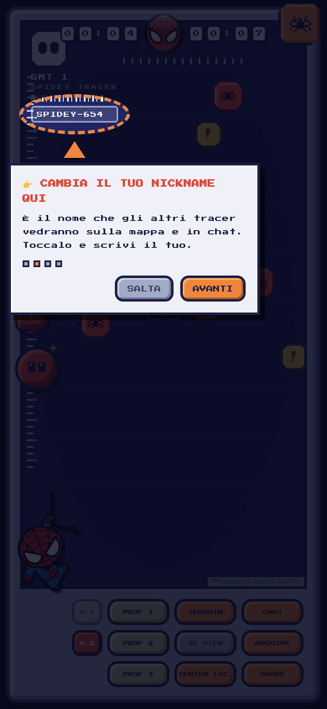

# SMT-1 · Spidey Tracer 🕷️

[](https://github.com/SmartDocRepair/spidy/actions/workflows/pages.yml)

Web app in stile **retro-pixel** ispirata al "tracer" dei film: al centro una **mappa reale**
della posizione di chi apre l'app, con **segnalini rossi** (contatti-ragno, generati
dall'app) e **segnalini gialli** (segnalazioni di altri utenti, anch'esse simulate).

> Solo la posizione dell'utente e la mappa sono reali (GPS + tile OpenStreetMap/CARTO
> ricolorate in blu "wireframe"); tutto il resto è fake, generato localmente dall'app.
> Nessun dato lascia mai il dispositivo.

**▶ Prova l'app:** https://smartdocrepair.github.io/spidy/

<p align="center"></p>

*Gli screenshot mostrano la mappa dimostrativa; aprendo l'app la mappa è quella reale del posto in cui ti trovi.*

## Caratteristiche

- 📍 **Posizione reale**: la mappa si centra sul GPS del dispositivo e ti segue (`watchPosition`).
- 🗺️ **Mappa vera**: tile OpenStreetMap/CARTO, ricolorate via CSS nel look blu wireframe del tracer.
- 🕷️ **Contatti-ragno fake**: 4–7 segnalini rossi ottagonali generati intorno a te; si muovono,
  lasciano tracce, generano eventi "NEW SIGHTING" con banner, beep e registro.
- ⚠️ **Segnalazioni utenti fake**: segnalini gialli con autore, messaggio, età e distanza reale calcolata.
- 🔵 **Utenti reali connessi**: chi apre l'app col GPS attivo appare agli altri come segnalino
  blu col proprio nickname (presenza via MQTT su broker pubblico, scade dopo 60 s di silenzio).
- 💬 **Chat vera + fake**: i messaggi della "rete avvistatori" simulata continuano ad arrivare,
  ma puoi scrivere davvero — i messaggi reali (contrassegnati da ⚡) raggiungono tutti i connessi.
- 🪪 **Nickname**: si imposta nel riquadro in alto a sinistra, salvato sul dispositivo.
- 🧭 **Wizard di primo avvio**: al primo accesso un tutorial cerchia i comandi principali
  (nickname, segnalazione avvistamenti, chat) e mostra l'avviso sulla condivisione della
  posizione; si può rivedere toccando la maschera bianca in alto a sinistra.
- 🎮 **UI pixel completa**: font Press Start 2P, cornice pervinca, scanline, pulsanti a rilievo.
- 📱 **PWA**: installabile su Android (e su iPhone via "Aggiungi a Home"), con service worker
  per l'avvio offline della shell (le tile della mappa restano sempre di rete).

> ⚠️ **Privacy**: presenza e chat viaggiano su un **broker MQTT pubblico** (EMQX/HiveMQ) su un
> canale in chiaro: nickname, messaggi e posizione (arrotondata a ~10 m) sono visibili a chiunque
> ascolti quel canale. Non scrivere dati personali. La posizione viene condivisa solo se il GPS
> reale è attivo; negando il permesso l'app resta in modalità locale.

## Come si usa

1. Apri **https://smartdocrepair.github.io/spidy/** dal telefono (serve HTTPS per il GPS).
2. Concedi il permesso di **posizione** quando richiesto.
3. Attendi la "triangolazione": la mappa si centra su di te e compaiono i segnalini.

Installazione come app:

- **Android** — Chrome → menu ⋮ → *Aggiungi a schermata Home* (o *Installa app*).
- **iPhone** — Safari → Condividi → *Aggiungi a Home*.

Se il GPS viene negato, l'app continua in **modalità demo** su una posizione predefinita (Roma).

## Comandi

| Controllo | Funzione |
|---|---|
| **CHAT** | chat fake della rete avvistatori |
| **ARCHIVE** | registro cronologico degli avvistamenti |
| **SHARE** | condivide il link dell'app |
| **TERRAIN** | alterna mappa blu "wireframe" e mappa normale |
| **3D VIEW** | modulo offline (come nel tracer originale 😄) |
| **CENTER LOC.** | ricentra sulla tua posizione |
| **PROF 1/2/3** | tutti i segnali · solo contatti rossi · solo segnalazioni gialle |
| **A.1 / A.2** | anelli radar sui contatti · tracce di movimento |
| **0 / S / T** | reset vista · audio on-off · tracking del contatto più vicino |
| **Pulsante occhi** | forza un nuovo avvistamento |

Toccando un segnalino si apre la scheda con segnale, distanza da te e dettagli.

## Struttura del progetto

```
index.html            → tutta l'app (markup, stile pixel, logica) — nessuna build
manifest.webmanifest  → metadati PWA (nome, icone, colori)
sw.js                 → service worker: cache della shell, mai delle tile
icon.svg / icon-*.png → icone pixel-art dell'app
vendor/leaflet/       → Leaflet 1.9.4 (libreria mappa, vendorizzata)
vendor/fonts/         → font Press Start 2P (subset latino, vendorizzato)
docs/                 → screenshot per questo README
.github/workflows/    → deploy automatico su GitHub Pages
```

### Sviluppo locale

Nessuna dipendenza da installare:

```bash
python3 -m http.server 8000
# apri http://localhost:8000 — il GPS funziona anche senza HTTPS su localhost
```

Ogni push su `main` (o sul branch di sviluppo) rilancia il deploy su GitHub Pages
tramite `.github/workflows/pages.yml`.

## Crediti e licenze delle componenti

- Mappa: © [OpenStreetMap](https://www.openstreetmap.org/copyright) contributors,
  tile scure di [CARTO](https://carto.com/) (uso non commerciale/attribuzione).
- Libreria mappa: [Leaflet](https://leafletjs.com/) 1.9.4, licenza BSD-2-Clause.
- Font: [Press Start 2P](https://fonts.google.com/specimen/Press+Start+2P) di CodeMan38,
  SIL Open Font License 1.1.

L'app è un progetto dimostrativo a scopo di intrattenimento: tutti gli avvistamenti
sono generati casualmente e non rappresentano persone o eventi reali.
